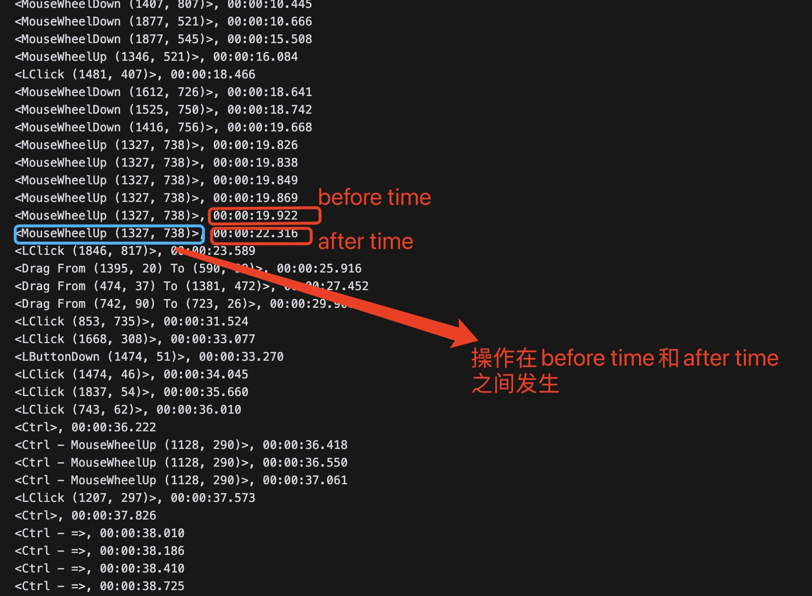

# data_process_gui
文件包括：
1. align.py: 用于处理单屏录屏，将log文件转化为对应的与视频匹配的sequence序列
2. align_2screen.py: 处理双屏录屏
3. cut_keyframe.py: 根据获取的sequence文件将对应的视频的对应时间的关键帧截取出来
4. GPT_response.py: 根据上传的2张图片获取GPT打caption的结果
## align.py
录屏得到的`./save`文件夹中有多个时间命名的文件夹，在第275行将`base_folder`变量设置为save文件夹的路径即可。运行后会在对应的时间文件夹分别生成sequence队列。
## align_2screen.py
与上面同理
## cut_keyframe.py
根据文件夹中的视频以及sequence.txt文件，将视频的关键帧截取出来，如果是双屏的话会自动根据坐标判断对应的屏幕并且截取。可以在主函数中修改路径
## GPT_response.py
具体使用方式可以在`tutorial.ipynb`中查看。目前没有专门的pr的视频，不太确定GPT打captioning的稳定性，可能prompt还需要进一步调整。估计得根据专门的软件视频用专门的prompt

## Sequence.txt文件如何理解
从第二行开始，前半部分为动作，后半部分为动作完成后的时间点，上一行的时间为动作尚未开始的时间点

